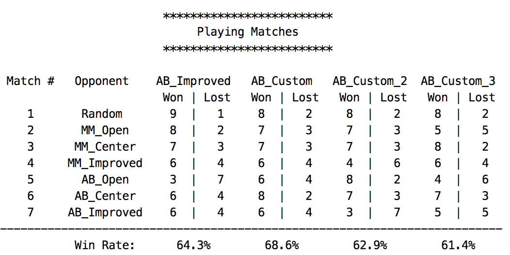

# Heuristic Analysys

The below picture shows the performance of the agents
using the implemented evaluation functions.

## custom_score()
This function evaluates each action by ratio of inactive player's
legal moves count and active player's legal moves count.

| Opponent    | Won | Lost |
| ----------- | --- | ---- |
| Random      | 8   | 2    |
| MM_Open     | 7   | 3    |
| MM_Center   | 7   | 3    |
| MM_Improved | 6   | 4    |
| AB_Open     | 6   | 4    |
| AB_Center   | 8   | 2    |
| AB_Improved | 6   | 4    |
__*Win Rate: 68.6%*__

Win rate is improved from __custom_score_2()__ instead of
decreasing wins against *AB_Open* and *MM_Open* opponent.
Especially this becomes getting better score against *AB_Improved*.

## custom_score_2()
This function evaluates each action by subtract inactive player's
legal moves from active player's legal moves.
Each count of moves are squared to emphasis the difference.
This function based on the simple consideration:
The more action able to choice, the harder to be checkmated.

| Opponent    | Won | Lost |
| ----------- | --- | ---- |
| Random      | 8   | 2    |
| MM_Open     | 7   | 3    |
| MM_Center   | 7   | 3    |
| MM_Improved | 4   | 6    |
| AB_Open     | 8   | 2    |
| AB_Center   | 7   | 3    |
| AB_Improved | 3   | 7    |
__*Win Rate: 62.9%*__

This rate is not bad, but this function seems difficult
 to defeat AB_Improved.

## custom_score_3()
This function evaluates each action by the distance between
each player's location. This function based on the consideration
that it is good at keeping long distance in order to be alive.

| Opponent    | Won | Lost |
| ----------- | --- | ---- |
| Random      | 8   | 2    |
| MM_Open     | 5   | 5    |
| MM_Center   | 8   | 2    |
| MM_Improved | 6   | 4    |
| AB_Open     | 4   | 6    |
| AB_Center   | 7   | 3    |
| AB_Improved | 5   | 5    |
__*Win Rate: 61.4%*__

## Conclusion
Based on the result, I would recommend to custom_score.
There are two reasons. First, of cause it has the highest win rate.
Second, this function has stability, in words, it keeps better win rate
even if any opponent comes. AB_Custom (custom_score) is
the only function which keeps 50% over win rate against all opponent
in the playing matches result.
